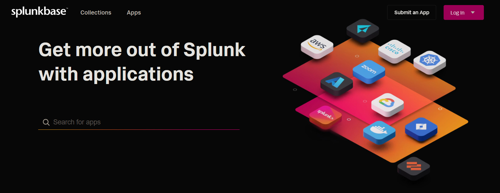

# Splunkbase App Downloader

This directory is designed for downloading Splunkbase apps, which can be found in the Splunkbase interface under the Apps section.


## Install

1. Clone the repository:
```sh
git clone https://github.com/tsnaketech/splunk_splunkbase_app_downloader.git
```
2. Navigate to the project directory:
```sh
cd splunk_splunkbase_app_downloader
```
3. Install the required dependencies:
```sh
pip install -r requirements.txt
```

## Usage

1. Configure the settings in `.env` file or in `.conf`,`.ini`,`.yaml`,`.yml` configuration file to match your environment.
2. Run the downloader script:
```sh
python splunkbase_downloader --config config.yaml
```

## Arguments
- `--config`,`-c`: Path to the configuration file .ini, .conf, .yaml or .yml.
- `--username`,`-u`: Splunkbase username. (Optional with --config)
- `--password`,`-p`: Splunkbase password. (Optional with --config)
- `--apps_file`,`-a`: Path to the file containing the list of apps to download. (Optional with --config)
- `--output`,`-o`: Output directory. (Optional with --config)

## Configuration

Sample configuration files are available with a `.sample` extension in `sample` folder. You can use these as a starting point for your own configuration:

- `sample\.env.sample`
- `sample\config.ini.sample`
- `sample\config.yaml.sample`

Make sure to customize these files to match your environment before running the downloader script.

## Contributing

Contributions are welcome! Please submit a pull request or open an issue to discuss your ideas.

## License

This project is licensed under the MIT License. See the [LICENSE](LICENSE) file for details.